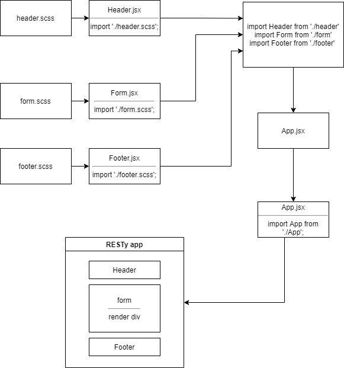

401 lab 20 Component Based UI
# RESTy
## Component Based UI
### Author: Tamara Al-billeh
* [submission PR](https://github.com/tamaraalbilleh/RESTy/pulls) .

### Running the app
- `npm start`

### Deployment

* [deployment for main branch](https://r5sty.herokuapp.com/) .

### UML

(Created with [diagrams](https://app.diagrams.net/))

[for more clear view](https://app.diagrams.net/#G1Rtxol2Nxk7vwhxGqKUq-KmZy2ien0bb3) 
