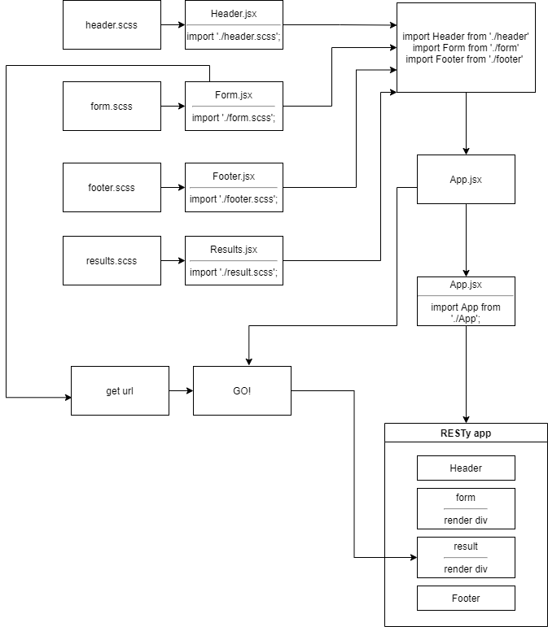
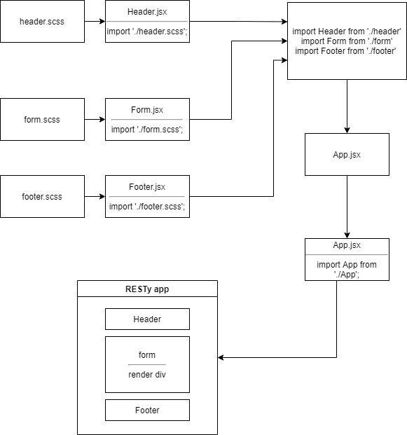

401 lab 20 Component Based UI
# RESTy
## Props and State (phase 2)
### Author: Tamara Al-billeh
* [submission PR](https://github.com/tamaraalbilleh/RESTy/pulls) .

### Running the app
- `npm start`

### Deployment
* [deployment for main branch on GitHub pages](https://tamaraalbilleh.github.io/RESTy/) .
### UML

[for more clear view](https://app.diagrams.net/#G1Rtxol2Nxk7vwhxGqKUq-KmZy2ien0bb3)

## Component Based UI (phase 1)
### Deployment

* [deployment for main branch on heroku](https://r5sty.herokuapp.com/) .

### UML

(Created with [diagrams](https://app.diagrams.net/))

[for more clear view](https://app.diagrams.net/#G1Rtxol2Nxk7vwhxGqKUq-KmZy2ien0bb3) 